**AI Usage Disclaimer:** Please note that Google's Gemini AI was utilized during the writing of this document strictly as an editorial tool. Its use was limited to refining sentence structure and applying Markdown formatting. The actual project execution, troubleshooting, and underlying ideas presented here were mixed of personal knowledge and AI-supported ideas.

# ITST 302 - Client-Server Technologies: Company Profile Website

## 1. Project Title
**Student Registration System**

## 2. Introduction
The **Student Registration System** is a foundational web application designed to securely capture, validate, and store student information. Its primary purpose is to streamline the enrollment process, ensuring that all necessary data (such as name, email, age, and profile picture) is collected accurately and efficiently. 

Data validation is of paramount importance in this system. It acts as the first line of defense against incorrect, incomplete, or malicious data entry. By enforcing specific rules, the system guarantees data integrity and prevents application crashes or database corruption. In the broader context of enterprise applications, registration systems serve as the critical gateway for user onboarding. They establish identity, manage access control credentials, and funnel structured data into central CRM or ERP systems, forming the bedrock of user management for large-scale organizations.

## 3. Objectives
The successful completion of this activity accomplished the following learning objectives:
*   Understand and implement the MVC (Model-View-Controller) architecture in Laravel.
*   Process and manage user input through web forms.
*   Apply strict server-side data validation rules.
*   Handle file uploads securely and link storage directories.
*   Execute database migrations and perform CRUD operations using Eloquent ORM.
*   Provide clear user feedback using session flash messages and error directives.

## 4. Laravel Request Lifecycle
When a user submits the registration form, the request follows a structured path through the Laravel framework:
1.  **Browser:** The user submits the HTML form containing their details and profile picture.
2.  **Route:** The `web.php` routing file intercepts the POST request and directs it to the appropriate controller method (e.g., `StudentController@store`).
3.  **Controller:** The controller receives the incoming request data.
4.  **Validation:** The controller validates the request against predefined rules (often using a Form Request or the `validate` method). If it fails, the user is redirected back with error messages.
5.  **Model:** If validation passes, the controller interacts with the `Student` Eloquent Model to prepare the data for insertion.
6.  **Database:** The Model executes the SQL query to insert the sanitized data into the database.
7.  **Response:** The controller returns an HTTP response, typically a redirect back to a profile or success page along with a flash message.

**Lifecycle Diagram:**
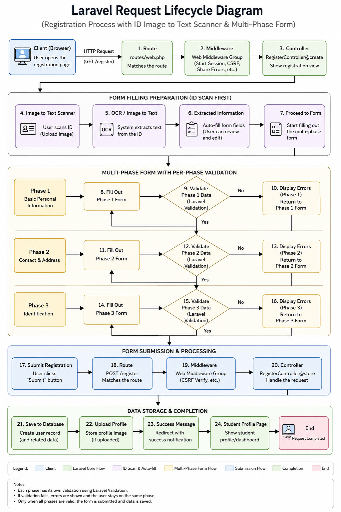

## 5. Validation Rules
The following validation rules were implemented, each serving a critical purpose:
*   **Required fields (`required`):** Ensures that crucial information like Name, Email, and Age are not left blank. This prevents incomplete database records.
*   **Unique constraints (`unique:students,email`):** Guarantees that no two students can register with the exact same email address, preventing duplicate accounts and ensuring accurate user identification.
*   **Email validation (`email`):** Verifies that the input matches a standard email format (e.g., user@example.com), preventing users from entering random text.
*   **Numeric validation (`numeric`, `min`, `max`):** Ensures that the age is a number and falls within a logical range (e.g., between 16 and 100), maintaining data logic.
*   **Image validation (`image`, `mimes:jpeg,png,jpg,gif`):** Confirms that the uploaded file is indeed an image and restricts it to safe, standard formats. This prevents users from uploading executable scripts or malicious files masquerading as images.
*   **File size restrictions (`max:2048`):** Limits the image upload size (e.g., to 2MB). This prevents denial-of-service (DoS) attacks via massive file uploads that could exhaust server storage and bandwidth.

## 6. Database Design
The system uses a straightforward relational table structure to store student data.

**Entity Relationship Diagram (ERD):**
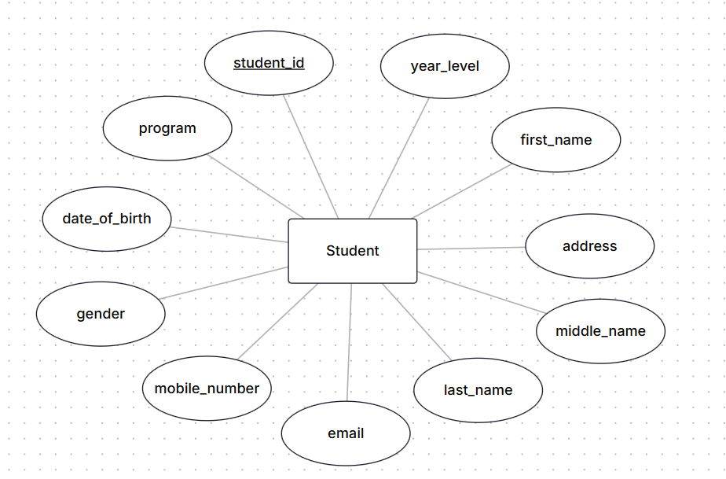

**Table Structure (`students` table):**

| Column Name | Data Type | Constraints | Description |
| :--- | :--- | :--- | :--- |
| `id` | BigInt (Unsigned) | Primary Key, Auto-Increment | Unique identifier for the student |
| `name` | Varchar(255) | Not Null | Full name of the student |
| `email` | Varchar(255) | Not Null, Unique | Contact email address |
| `age` | Integer | Not Null | Age of the student |
| `profile_picture` | Varchar(255) | Nullable | File path to the uploaded image |
| `created_at` | Timestamp | Nullable | Record creation time |
| `updated_at` | Timestamp | Nullable | Record last update time |

## 7. Flowchart
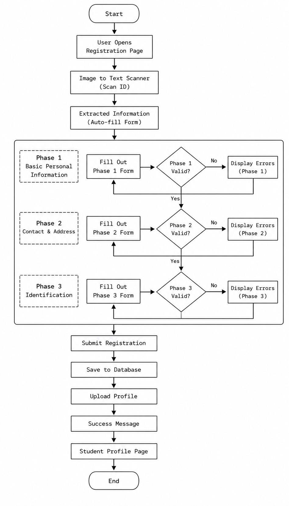

## 8. Screenshots
*   **Registration Form:** 
    *   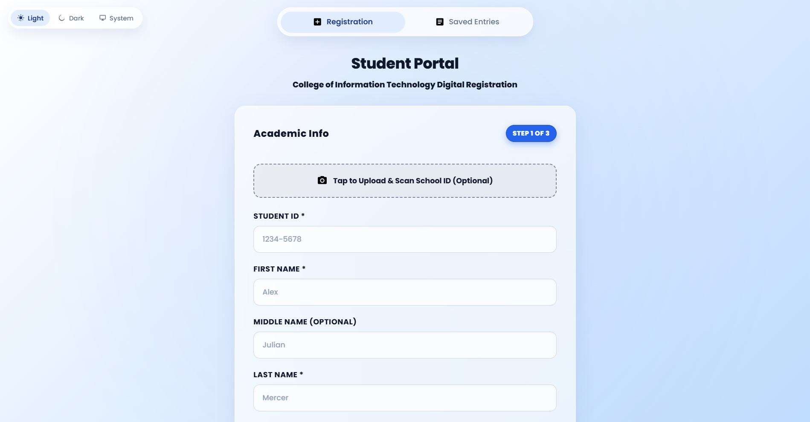
    *   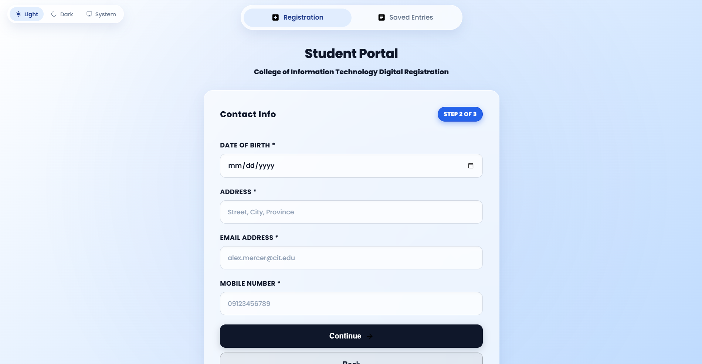
    *   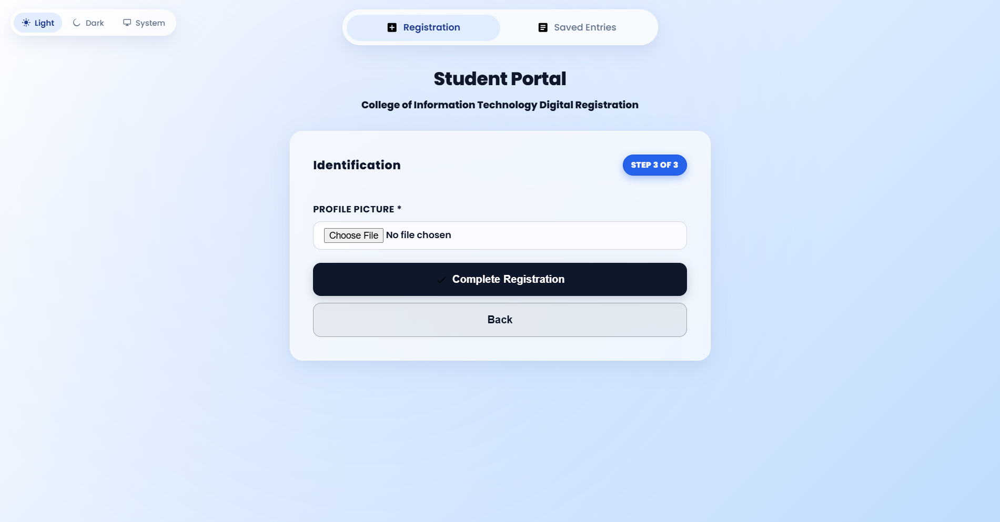
*   **Validation Errors:** 
    *   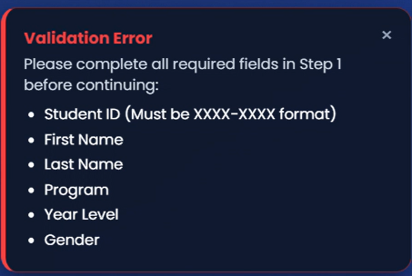
    *   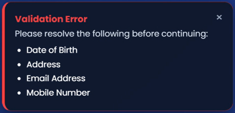
    *   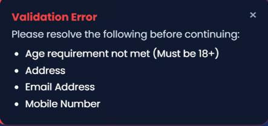
    *   
    *   
*   **Successful Registration & Flash Message:** 
*   **Uploaded Profile Picture:** 
*   **Database Table:** 
    *   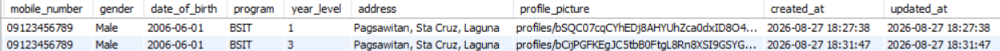
    *   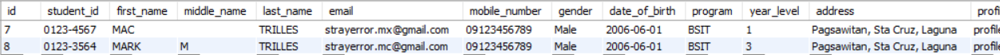
*   **Student Profile Page:** 
*   **Browser Output:** 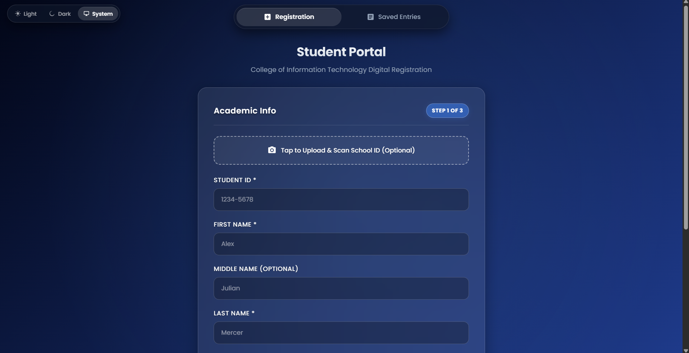
*   **Terminal Output:** 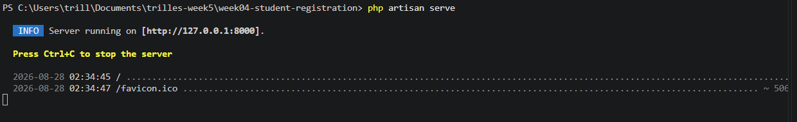
*   **VS Code Project Structure:** 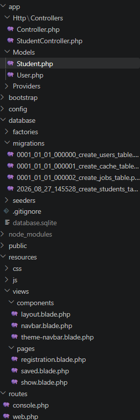
*   **GitHub Repository:** 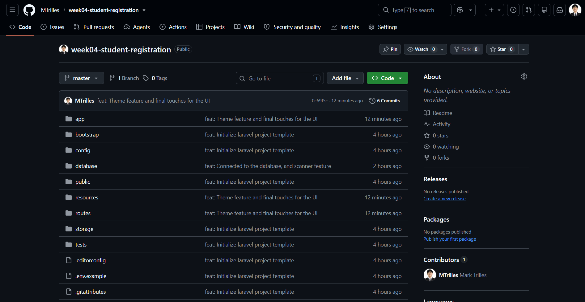

## 9. Problems Encountered
During development, three notable challenges arose:
1.  **Validation errors not appearing:** Initially, when submitting a blank form, the page simply refreshed without displaying the error messages to the user.
2.  **Image upload path incorrect (Storage Link Missing):** After successfully uploading an image and saving the path to the database, the image would appear as a broken link on the profile page (resulting in a 404 error).
3.  **Mass Assignment Exception:** When attempting to save the validated request array directly into the Eloquent model using `Student::create()`, Laravel threw an `Illuminate\Database\Eloquent\MassAssignmentException`.

## 10. Solutions
Here is how each problem was resolved:
1.  **Solving Validation Errors Display:** The issue was resolved by adding Blade `@error` directives to the HTML input fields. By embedding `@error('field_name') {{ $message }} @enderror` directly beneath the input fields, Laravel's session error bag was successfully rendered on the frontend.
2.  **Solving the Image Path Issue:** The uploaded images were being stored in `storage/app/public`, which is inaccessible directly from the web browser. This was fixed by running the Artisan command `php artisan storage:link`. This created a symbolic link from `public/storage` to `storage/app/public`, making the images publicly accessible.
3.  **Solving Mass Assignment:** Laravel protects databases by preventing mass assignment by default. To fix this, I navigated to the `Student.php` model and added a `$fillable` property array containing the allowed fields: `protected $fillable = ['name', 'email', 'age', 'profile_picture'];`.

## 11. Reflection
Building the Student Registration System provided profound insights into the critical nature of robust back-end architecture, particularly regarding how user input is handled and sanitized. First and foremost, the importance of validation cannot be overstated. Validation is not merely a feature to enhance user experience; it is a fundamental security requirement. When developers handle user input, they must operate under the assumption that all input is potentially flawed or malicious. By strictly defining what data is acceptable (e.g., ensuring an email is actually an email, or an age is a valid integer), the application protects its database from corruption and its logic from failing. 

Through this project, the distinct benefits of server-side validation over client-side validation became exceedingly clear. Client-side validation (using HTML5 properties like `required` or JavaScript) is excellent for providing immediate feedback to the user, improving the overall UI experience by preventing unnecessary page reloads. However, client-side validation is fundamentally insecure because tech-savvy users can easily bypass it by disabling JavaScript or modifying the DOM using browser developer tools. Server-side validation—like the rules implemented in the Laravel controller—acts as the ultimate, un-bypassable gatekeeper. Regardless of what happens on the client’s browser, the server will independently verify the data before processing it. Relying solely on client-side checks leaves an application wide open to exploitation.

Furthermore, implementing the profile picture upload feature highlighted the importance of file security in web applications. Allowing users to upload files introduces significant risks. If an application accepts any file type without verification, a malicious actor could upload an executable PHP script instead of a JPEG. If the server executes that script, the entire system could be compromised. Restricting file types using MIME types, enforcing maximum file sizes, and storing uploads in a non-executable directory are essential practices to mitigate these vulnerabilities.

Finally, observing this basic implementation helps conceptualize how registration systems function in real-world enterprise software. In an enterprise environment, a registration system is the first touchpoint in a complex web of interconnected services. The data collected here doesn't just sit in a single table; it integrates with Customer Relationship Management (CRM) tools, Single Sign-On (SSO) authentication servers, and automated marketing workflows. Because this data cascades through the entire enterprise ecosystem, the strict validation, structural integrity, and security practices learned in this foundational project are the exact same principles used to secure multi-million-dollar software infrastructures.

## 12. References

Laravel. (n.d.). *Validation*. Laravel Documentation. Retrieved from https://laravel.com/docs/validation

MDN Web Docs. (n.d.). *Client-side form validation*. Mozilla. Retrieved from https://developer.mozilla.org/en-US/docs/Learn/Forms/Form_validation

MySQL. (n.d.). *MySQL 8.0 Reference Manual: Data Types*. Oracle Corporation. Retrieved from https://dev.mysql.com/doc/refman/8.0/en/data-types.html

PHP: Hypertext Preprocessor. (n.d.). *Handling file uploads*. The PHP Group. Retrieved from https://www.php.net/manual/en/features.file-upload.php

Tailwind Labs. (n.d.). *Tailwind CSS Documentation*. Retrieved from https://tailwindcss.com/docs
